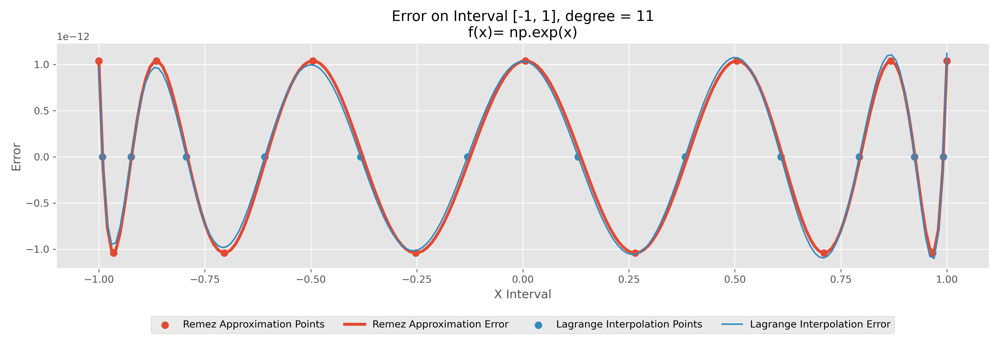
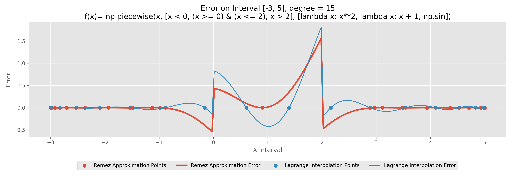

# Remez: Best Uniform Approximation

[](https://github.com/chunwangpro/Remez_Python)

Python implementation of  [Remez algorithm](https://en.wikipedia.org/wiki/Remez_algorithm),  provides the best uniform polynomial approximation to functions based on the minimization of the maximum absolute error and the [equioscillation theorem](https://en.wikipedia.org/wiki/Equioscillation_theorem).

## Similar library

A similar C++ [library](https://github.com/samhocevar/lolremez?tab=readme-ov-file#docker) achieves the same accuracy as ours. MATLAB version can be found [here](https://ww2.mathworks.cn/matlabcentral/fileexchange/8094-remez-algorithm), but it often fails.

## Basic usage

Write the math expression of $f(x)$ and its derivative $f'(x)$ in Numpy or Sympy string like style, then set approximation interval and polynomial degrees. 

For example:

Approximate `atan(sqrt(3+x³)-exp(1+x))` over the interval `[sqrt(2),pi²]` with 5-th degree polynomial:

```python
# f(x)
fx = "np.arctan(np.sqrt(3 + x**3) - np.exp(1 + x))"
# f'(x)
g = "(np.sqrt(3 + x**3) - np.exp(1 + x))"
g_prime = "((3 * x**2) / (2 * np.sqrt(3 + x**3)) - np.exp(1 + x))"
fx_der = f"({g_prime}) / (1 + {g}**2)"
# Remez and visualization
interval = [np.sqrt(2), np.pi**2]
n = 5
px, xn, history = remez(fx, fx_der, interval, n)
visualization(fx, px, xn, history, interval, n)
```

Results:

```bash
Pn(x):
- 3.955756933047265e-05 * x**5 + 0.0012947712130833584 * x**4 - 0.01654139703555944 * x**3
+ 0.10351664953941357 * x**2 - 0.32051562487328494 * x - 1.1703528319321932

xn points:
[1.41421356 1.83693284 3.14845216 5.17561358 7.42752857 9.19850669
 9.8696044 ]

Converge iteration: 7
MAE of approximation: 0.0012079008992569307
MAE of interpolation: 0.0021889162615582602
```


Compare Remez approximation with Lagrange interpolation, as figure shows, our method has lower Max-Error and achieved equioscillation on the whole interval.

## Examples of smooth function

### sin(x)


### exp(x)



### log(1+x**2)


### sqrt(1+x**2)


### 1 / (1+x**2)


## Examples of non-smooth function

### abs(sin(x))


### piecewise function



## Evaluation of error v.s. polynomial degrees

Higher polynomial degree may result in lower error with a slight growth of time consumption.


